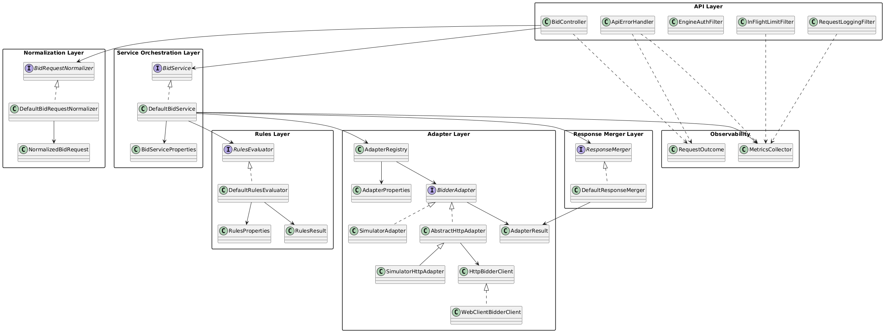

# System Architecture

This document is the primary technical reference for engine architecture and layer responsibilities.

## High-Level Architecture

```text
SSP / Publisher       POST /openrtb2/bid
↓
API                   Filters (auth, in-flight limiting, logging) + Validation (schema/shape)
↓
Normalization         Maps payload to internal 2.6-first model
↓
Rules Engine          Evaluate inventory, floor, and adapter allow/deny policy
↓
Orchestration         Computes timeout budget and fans out to enabled adapters
↓
Adapters              Execute bidder calls and map outcomes to internal result types
↓
Response Merger       Selects the best valid bid, or no-bid if none is eligible
↓
SSP                   Returns contract-compliant status/body/headers
```

Class diagram source: `architecture-class-diagram.puml`



---

## Layer Responsibilities

### API Layer (Ingress)

**Purpose**: Own the public HTTP contract and endpoint behavior.

**Responsibilities**:

- Expose `POST /openrtb2/bid`.
- Parse request body and perform early validation.
- Apply inbound request filters (`/openrtb2/**`) for:
    - optional auth (`X-Api-Key`, profile-based)
    - in-flight rejection (`429`)
    - request correlation and logging headers
- Return contract-aligned status codes and response body shape.

**Details**:

- Accept OpenRTB 2.5/2.6 requests and respond with OpenRTB-compliant bid/no-bid payloads.
- Primary response mapping: `200` (bid), `204` (no-bid), `400` (invalid input), `429` (in-flight limit), `503` (configuration failure), `500` (internal error).
- Echo and propagate correlation headers used across engine and adapters (`X-Request-Id`, `X-Caller`).

### Normalization Layer

**Purpose**: Convert external OpenRTB payloads to a deterministic internal model.

**Responsibilities**:

- Accept OpenRTB 2.5/2.6 inputs and normalize into a 2.6-first internal representation.
- Apply deterministic defaults and field shaping.
- Preserve extension payloads (`ext`) needed for downstream adapters.
- Keep normalization side-effect free and deterministic for identical input.

**Details**:

- Validation boundary is split: schema/shape at API ingress, deterministic value shaping here.
- Core normalization guarantees include media-type selection precedence and safe defaults for bidfloor/time budget
  inputs.
- Partner-specific fields are preserved through `ext` pass-through on supported objects.

### Rules Engine

**Purpose**: Determine eligibility of impressions/adapters before bidder fan-out.

**Responsibilities**:

- Apply configured inventory and bidfloor constraints.
- Resolve adapter allow/deny filtering.
- Produce a filtered execution context used by orchestration.

**Details**:

- Rule set is configuration-driven and evaluated in-memory.
- Current MVP rule families: inventory allow/deny, bidfloor filtering, adapter allow/deny.
- Evaluation order: bidfloor filtering -> inventory allow/deny -> adapter allow/deny.
- Configuration source: Spring properties under `rules.*` (with environment override via Spring binding).
- Performance profile: in-memory only, non-blocking, no expression engine in MVP.
- Output is a narrowed execution scope (eligible imps/adapters), not a transport decision.

### Service Orchestration Layer

**Purpose**: Coordinate request execution across rules, adapters, and merge logic.

**Responsibilities**:

- Compute request deadline and per-adapter timeout budget.
- Trigger enabled adapters concurrently using reactive flows.
- Collect adapter results and pass them to merger.
- Enforce no-adapter-enabled and timeout/error outcome handling rules.

**Details**:

- Deadline model applies a request-level time budget and derives adapter-level budgets from it.
- Fan-out is non-blocking and parallel over the eligible adapter set.
- Aggregation keeps outcome semantics stable across mixed adapter results (bid/no-bid/error/timeout).

### Adapter Layer

**Purpose**: Isolate bidder integration details behind a stable internal interface.

**Responsibilities**:

- Encapsulate bidder endpoint communication and protocol mapping.
- Convert bidder responses/errors into internal adapter result types.
- Treat bidder non-2xx and timeout scenarios with standard mappings.
- Transform internal request model to bidder-specific payloads.
- Propagate request context headers (`X-Request-Id`, `X-Caller`) when present.

**Details**:

- Adapter contract steps: map request, execute call, parse response, return internal result.
- Standard error mapping: timeout -> no-bid outcome; invalid response -> bad-response error; network/runtime failure ->
  adapter error outcome.
- HTTP adapters use `HttpBidderClient` (WebClient-based by default) to keep transport pluggable.

**MVP constraints**:

- Retries are not part of current behavior.
- No blocking I/O; use reactive HTTP clients only.

### Response Merger

**Purpose**: Convert a set of adapter outcomes into one API response.

**Responsibilities**:

- Ignore invalid/non-positive bids.
- Select the highest valid bid.
- Return no-bid when no eligible bid remains.
- Build a contract-compliant OpenRTB response payload.

**Details**:

- Winner selection is deterministic and price-first on valid bids.
- If no valid bid survives merge policy, response is no-bid (`204`).
- Output preserves request/imp correlation required by OpenRTB response rules.

### Observability

**Purpose**: Provide latency/error visibility without changing request decisions.

**Responsibilities**:

- Emit request and adapter metrics.
- Emit structured logs with request correlation identifiers.
- Distinguish internal no-bid reasons through metrics/logging dimensions.

**Details**:

- Metrics cover request outcomes, adapter failures, rejections, and latency timers.
- Core metric families: `requests_total`, `errors_total`, `adapter_timeouts`, `adapter_bad_response`, `adapter_errors`,
  `engine_rejected_total`, `request_latency_seconds`.
- Timer metrics are exported as Prometheus `*_seconds_count`, `*_seconds_sum`, and buckets (when enabled).
- Logs include request correlation, caller context, adapter identity, latency, and outcome.
- Tracing scope: request IDs are implemented; distributed tracing spans are planned.
- Dashboard scope: traffic, latency distribution, error rates, and adapter health.

---

## Data and Boundary Rules

- **Contract** boundary: API layer owns external HTTP/OpenRTB contract.
- **Internal model** boundary: normalization output is the canonical input for rules and orchestration.
- **Policy** boundary: rules engine decides eligibility, not transport behavior.
- **Integration** boundary: adapter layer owns bidder protocol concerns.
- **Composition** boundary: merger builds final response from adapter outcomes.

---

## Cross-Cutting Architecture Constraints

- Reactive/non-blocking execution only (WebFlux/Reactor).
- Fail-fast validation at ingress and normalization boundaries.
- Latency-aware timeout budgeting across request and adapters.
- Stateless request handling; no per-request shared mutable global state.
- Low-allocation preference in hot paths (normalization, fan-out, merge).

---

## Design Principles

- Keep boundaries explicit between `api`, `normalization`, `rules`, `service`, `adapters`, and `observability`.
- Keep external contract concerns separate from internal decision mechanics.
- Prefer deterministic behavior for identical inputs and configuration.
- Keep architecture MVP-oriented: add complexity only when driven by measured need.

---

## Testing Strategy

- Unit focus: request parsing, validation, rules evaluation, and response building.
- Integration focus: simulator/mocked adapters and end-to-end request flow.
- Integration test convention: package `ro.dede.bidbridge.engine.it`, class suffix `*IT`.
- Load testing: `bidbridge-loadgen` for QPS control and JSON/JSONL replay (optional `wrk`/`k6`).
- Chaos checks: timeout injection, adapter failure simulation, and network delay scenarios.

---

## Performance, Security, and Compliance

Performance targets:

- P95 latency < 50ms
- P99 latency < 80ms
- Throughput > 5k QPS

Performance approach:

- Netty event loops, async I/O, low-allocation hot paths, and budget-aware fan-out.

Security baseline:

- HTTPS-only deployment at edge/runtime.
- In-flight limiting via `engine.limits.maxInFlight` (`429` on `/openrtb2/**`).
- Request size limits, fail-fast input validation, and secure secret handling.

MVP status:

- Input validation and in-flight limiting are implemented in-engine.
- Broader rate limiting and HTTPS termination remain deployment/edge responsibilities.

Compliance:

- Preserve GDPR/CCPA-related signals and consent fields through processing boundaries.
