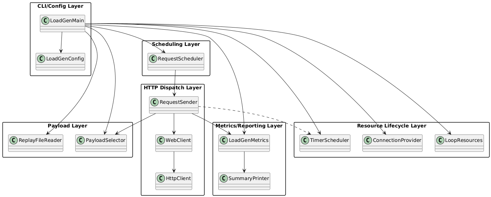

# LoadGen Architecture

This document is the primary technical reference for load generator architecture and execution flow.

Class diagram source: `bidbridge-loadgen/docs/architecture-class-diagram.puml`



## High-Level Architecture

```text
CLI args / env
↓
Config Parse            validate required flags and defaults
↓
Payload Source          single JSON file or JSONL replay lines
↓
Reactive Scheduler      fixed-period Flux.interval at target QPS
↓
HTTP Dispatcher         WebClient/Reactor Netty POST with bounded concurrency
↓
Result Aggregation      status/timeout/error counts + latency stats
↓
Summary Output          achieved QPS and status distribution
```

## Layer Responsibilities

### CLI and Config Layer

Purpose: validate runtime inputs before traffic generation starts.

Responsibilities:
- Parse `--url`, `--request-file`/`--replay-file`, `--qps`, `--duration-seconds`, `--concurrency`, `--timeout-ms`.
- Enforce mutually exclusive payload mode:
  - single request mode (`--request-file`)
  - replay mode (`--replay-file`)
- Resolve optional auth/context headers:
  - `X-Api-Key` from `--bid-api-key` or `BID_API_KEY`
  - `X-Caller` from `--x-caller` or `X_CALLER`
- Fail fast with usage output for invalid arguments.

### Payload Layer

Purpose: provide request bodies to the send pipeline.

Responsibilities:
- Read one full JSON request in single-request mode.
- Read JSONL replay file, trim/skip empty lines.
- Reject empty replay input.
- Serve payloads round-robin when replay file contains multiple lines.

### Scheduling Layer

Purpose: maintain target send cadence with non-blocking backpressure-aware flow.

Responsibilities:
- Compute send period from target QPS.
- Drive send ticks via `Flux.interval`.
- Limit run duration with `take(Duration)`.
- Use dedicated timer scheduler to avoid leaving shared threads running after completion.

### HTTP Dispatch Layer

Purpose: execute outbound bid requests with bounded parallelism.

Responsibilities:
- Use Reactor Netty `HttpClient` and WebFlux `WebClient`.
- Send `POST` JSON requests with optional headers.
- Limit in-flight calls with `flatMap(..., concurrency)`.
- Apply per-request client timeout (`timeout-ms`).
- Treat timeout and non-timeout exceptions as client-side failures.

### Metrics and Reporting Layer

Purpose: provide run-level performance and status outcomes.

Responsibilities:
- Track totals, status buckets (`200`, `204`, other `2xx`, `4xx`, `5xx`, `other`), errors, and timeouts.
- Track latency min/avg/max in milliseconds.
- Print final summary including elapsed time and achieved QPS.

### Resource Lifecycle Layer

Purpose: ensure deterministic cleanup for repeated local runs.

Responsibilities:
- Create dedicated connection pool and loop resources.
- Dispose scheduler, connection provider, and loop resources on completion.
- Avoid lingering `exec:java` threads after run exit.

## Data and Boundary Rules

- LoadGen does not implement OpenRTB semantic validation; it sends payloads as provided.
- HTTP response status distribution is reported, not interpreted as business correctness.
- Timeout/error classification is client-side transport outcome, independent of server metrics.

## Cross-Cutting Constraints

- Non-blocking reactive execution only.
- Predictable load shape from QPS/duration/concurrency inputs.
- Lightweight in-process metrics only; no external metrics backend integration.
