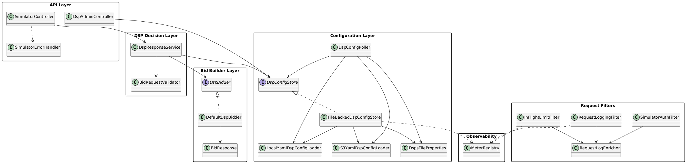

# Simulator Architecture

This document is the primary technical reference for simulator architecture and layer responsibilities.

Class diagram source: `bidbridge-simulator/docs/architecture-class-diagram.puml`



## High-Level Architecture

```text
Engine / Test Client   POST /openrtb2/{dsp}/bid
↓
API Ingress            SimulatorController + SimulatorErrorHandler
↓
Request Filters        RequestLogging -> Auth (optional) -> In-Flight limiting
↓
DSP Decision Service   DSP lookup, validation, no-bid/bid decision, delay simulation
↓
Bid Builder            DefaultDspBidder (fixed-price OpenRTB response)
↓
Config Management      FileBackedDspConfigStore (+ local/S3 loader + poller/admin reload)
↓
Observability          Request logs + Micrometer metrics + actuator/prometheus
```

## Layer Responsibilities

### API Layer

Purpose: own simulator HTTP endpoints and public response mapping.

Responsibilities:
- Expose `POST /openrtb2/{dsp}/bid`.
- Expose admin endpoints: `POST /admin/reload-dsps`, `GET /admin/dsps`.
- Normalize common error responses through `SimulatorErrorHandler`.
- Always include `X-OpenRTB-Version: 2.6` on simulator API responses.

### Request Filter Layer

Purpose: apply cross-cutting request policies before business handling.

Responsibilities:
- `RequestLoggingFilter`:
  - capture/generate `X-Request-Id`, echo `X-Request-Id`, propagate `X-Caller`
  - write one business-path summary log line
  - emit request outcome and latency metrics
- `SimulatorAuthFilter` (conditional on `simulator.auth.enabled=true`):
  - protect `/openrtb2/**` with `X-Api-Key`
  - protect `/admin/**` with `X-Admin-Token`
  - return `401` with `{"error":"Unauthorized"}`
- `InFlightLimitFilter`:
  - enforce `simulator.maxInFlight` on `/openrtb2/**`
  - return `429` with `{"error":"Too many requests"}`

### DSP Decision Layer

Purpose: execute deterministic simulator behavior per DSP configuration.

Responsibilities:
- Resolve DSP from path (`/openrtb2/{dsp}/bid`) via `DspConfigStore`.
- Validate request minimally (`id`, `imp`, `imp.id`).
- Apply configured behavior:
  - disabled DSP -> `204`
  - probabilistic no-bid (`bidProbability`) -> `204`
  - bid path -> invoke bidder and return `200` payload
- Apply configured artificial delay (`responseDelayMs`) without blocking.

### Bid Builder Layer

Purpose: create synthetic OpenRTB bid payloads for tests.

Responsibilities:
- `DefaultDspBidder` generates one-seat/one-bid response.
- Use fixed-price behavior (`fixedPrice`, fallback `0.01` when non-positive).
- Fill `cur` from config (`currency`, fallback `USD`).
- Fill `adm` from config (`admTemplate`, fallback `<vast/>`).

### Configuration Layer

Purpose: provide hot-reloadable DSP behavior configuration from local file or S3.

Responsibilities:
- Keep active config in atomic in-memory state (`FileBackedDspConfigStore`).
- Support local path and `s3://bucket/key` loading.
- Validate YAML structure and value constraints on reload.
- Keep last good config on reload failure.
- Poll config source periodically (`DspConfigPoller`) and expose manual admin reload.

### Observability Layer

Purpose: provide request-level visibility and reload health.

Responsibilities:
- Structured per-request summary logs on business paths.
- Request outcome counter:
  - `sim_requests_total{outcome="bid|nobid|error"}`
- Request latency timer (Prometheus export from Micrometer Timer `sim_latency_ms`):
  - `sim_latency_ms_seconds_count`
  - `sim_latency_ms_seconds_sum`
  - `sim_latency_ms_seconds_bucket` (if histogram buckets are enabled)
- Reload/config metrics:
  - `sim_reload_success_total`
  - `sim_reload_fail_total`
  - `sim_active_dsps`
  - `sim_rejected_total{reason="in_flight_limit"}`

## Data and Boundary Rules

- API boundary: request/response contract and admin endpoints.
- Policy boundary: filters own auth and concurrency limits.
- Behavior boundary: `DspResponseService` owns simulator decision flow.
- Config boundary: loaders parse/validate external YAML; service reads in-memory snapshot only.
- Observability boundary: metrics/logging never alter response decisions.

## Cross-Cutting Constraints

- WebFlux/reactive request handling for HTTP path.
- Minimal simulator logic by design; no bidder-complexity abstractions.
- Deterministic defaults and safe fallbacks for config fields.
- Config reload is atomic and failure-tolerant (last good state preserved).
